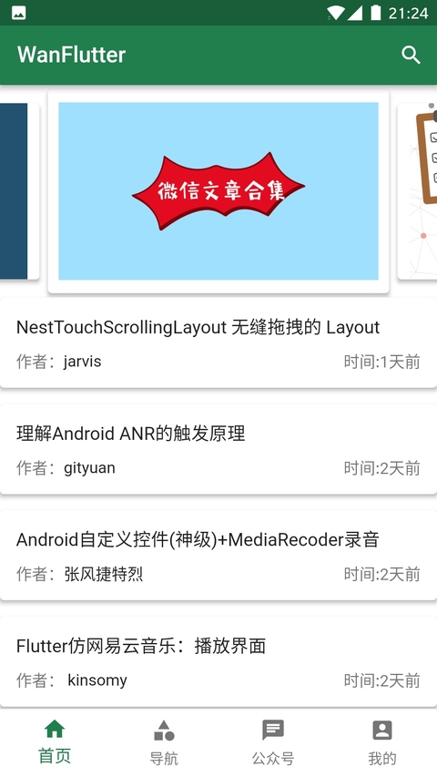
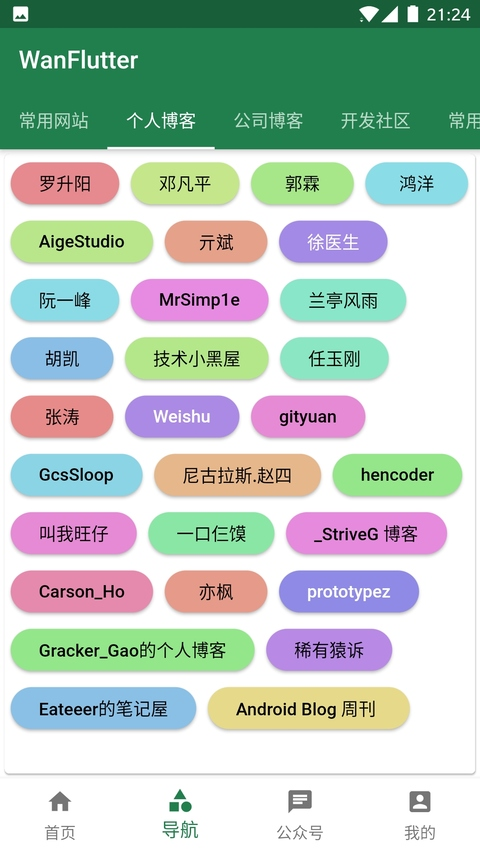
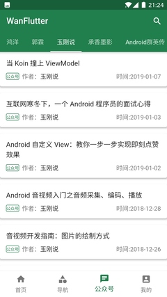
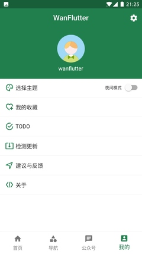
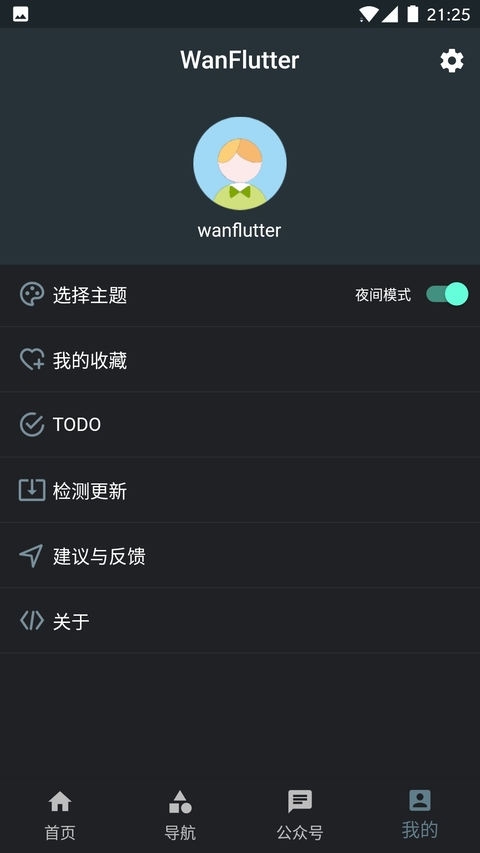
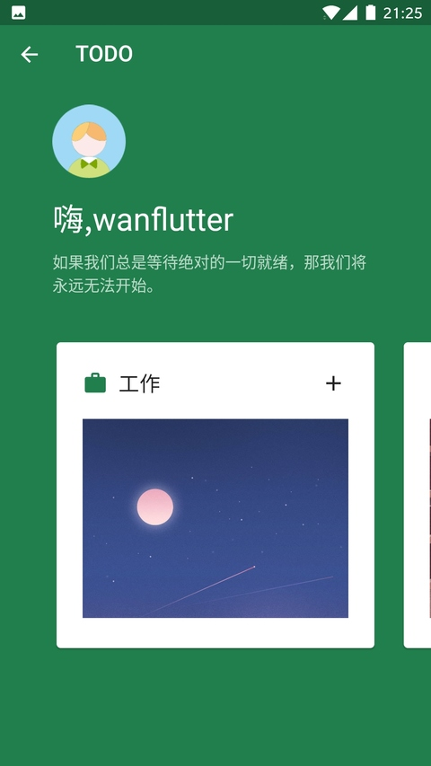
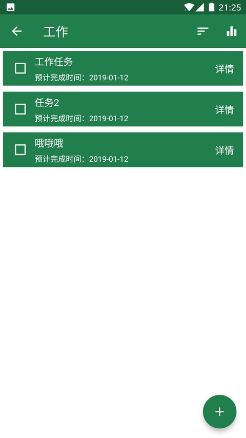
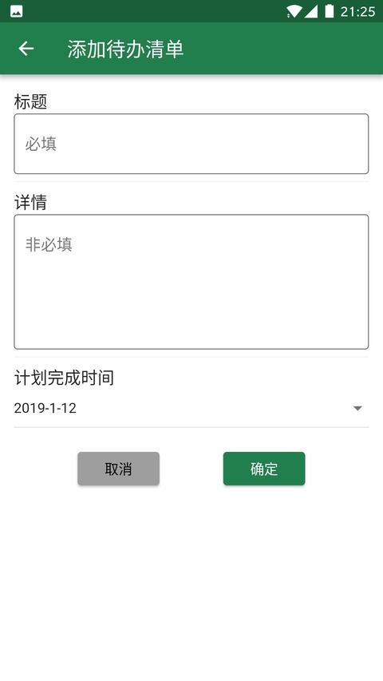

# FlutterWan

基于[WanAndroid](http://wanandroid.com/blog/show/2) API数据的Flutter应用。

仅做学习练习使用。

## Flutter

关于Flutter使用运行详情，请参考官方文档
[documentation](https://flutterchina.club).

## 运行截屏：

## 历史版本

**v1.4** 细节调整

**v1.3** Bug修复，增加用户反馈

**v1.2** Bug修复，细节优化

**v1.1** Bug修复，增加TODO

**v1.0** 基本功能，凑合能跑

## 应用下载
[下载地址](https://www.pgyer.com/wan_flutter)

